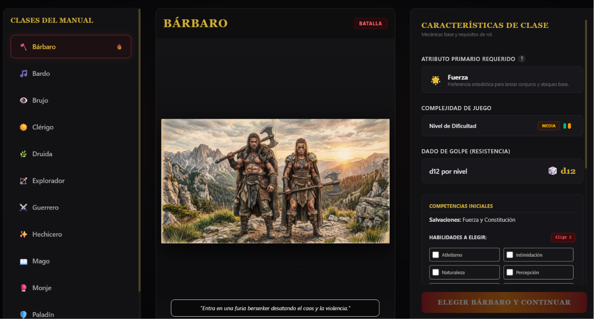
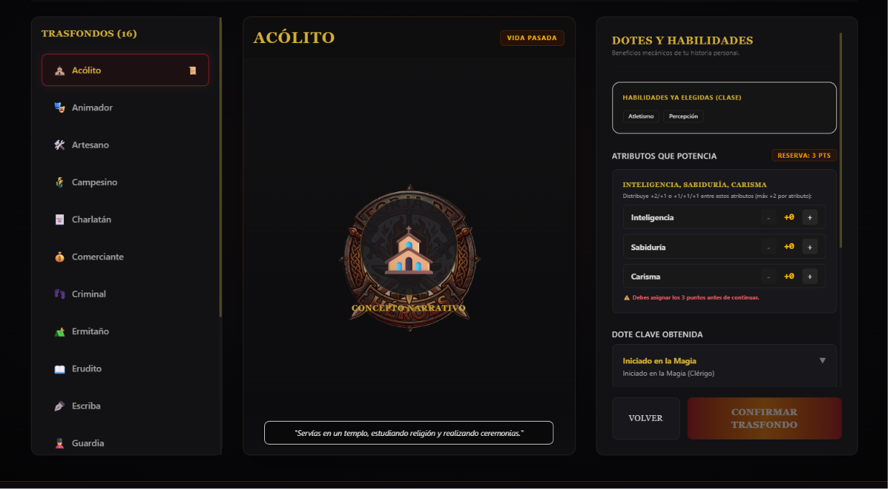
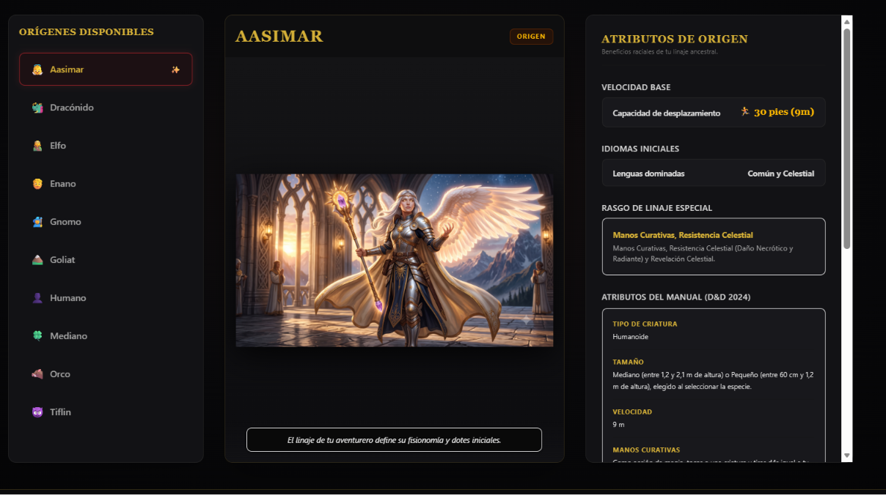
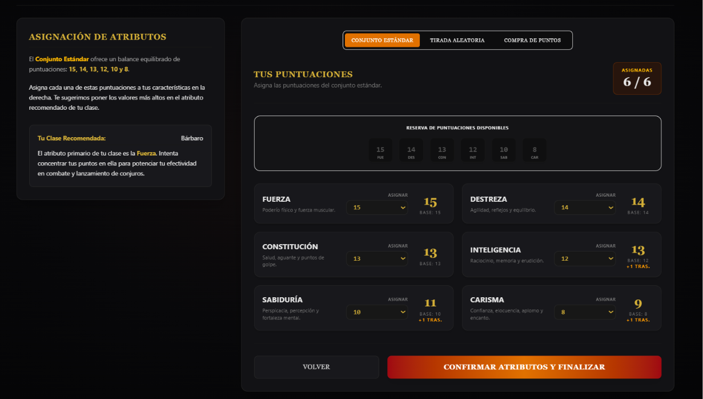

# 🐉 D&D 5e Character Builder & Sheet Manager

[](https://dnd.wizards.com/resources/systems-reference-document)
[](https://nodejs.org)
[](https://www.mongodb.com)
[](https://react.dev)

Una aplicación web moderna e interactiva diseñada para la creación, gestión y exportación de hojas de personaje de **Dungeons & Dragons (5ª Edición)**. Adaptada al español y pensada para la comunidad de rol de Latinoamérica y España.

[🌐 Ver Demo en Vivo](#) | [🐛 Reportar un Problema / Sugerencia](https://github.com/JoseMiguelSanmartin1999/dndsheetGame/issues)

---

## 📸 Vista Previa

> [!NOTE]




---

## ✨ Características Principales

*   **🧙‍♂️ Creación Paso a Paso:** Flujo guiado e intuitivo para la asignación de atributos (Puntos de Característica), selección de razas, clases y trasfondos basados en el SRD 5.1 en español.
*   **📊 Cálculos Dinámicos en Tiempo Real:** Actualización automática y precisa de los modificadores de habilidad, bonificador de competencia, Clase de Armadura (CA), iniciativa y salvaciones al cambiar el equipamiento o los atributos.
*   **⚔️ Gestión Activa en Partida:** Rastreador interactivo para controlar puntos de vida actuales/temporales, ranuras de conjuros, inventario dinámico, notas de sesión y estados.
*   **💾 Persistencia Offline-First:** Auto-guardado local integrado en el navegador para evitar pérdidas de datos, con opción de sincronización en la nube al iniciar sesión.
*   **📄 Exportación de Fichas:** Descarga de la hoja de personaje en formato PDF interactivo oficial y exportación/importación en formato JSON para respaldos rápidos.

---

## 🛠️ Stack Tecnológico

El proyecto está diseñado bajo una arquitectura desacoplada y modular:

### Frontend
*   **Framework:** React / Vite con TypeScript para un desarrollo ágil y tipado estricto.
*   **Estilos:** Tailwind CSS para un diseño responsivo, moderno y adaptable a pantallas móviles/tabletas.
*   **Gestión de Estado:** Zustand para un manejo de estado global ligero y reactivo con persistencia local.
*   **Cliente HTTP:** Axios para la comunicación con la API.

### Backend
*   **Entorno:** Node.js con Express para la API REST.
*   **Base de Datos:** MongoDB & Mongoose para almacenar esquemas de personajes flexibles basados en documentos JSON.
*   **Seguridad:** Autenticación de usuarios mediante JWT (JSON Web Tokens) y contraseñas encriptadas con bcrypt.

---

## 📁 Estructura del Proyecto

```text
dndsheetGame/
├── Frontend/               # Aplicación cliente (React + TypeScript)
│   ├── src/
│   │   ├── components/     # Componentes de UI comunes y reutilizables
│   │   ├── features/       # Módulos del creador de personaje y hoja activa
│   │   ├── services/       # Clientes de API e integración de servicios
│   │   └── utils/          # Reglas del juego y calculadoras matemáticas de D&D
│   └── public/             # Recursos estáticos (imágenes, iconos)
│
└── Backend/                # API del servidor (Node.js + Express)
    ├── src/
    │   ├── controllers/    # Controladores de peticiones HTTP
    │   ├── models/         # Modelos de Mongoose (Personaje, Usuario)
    │   ├── routes/         # Rutas de la API (Autenticación, Personajes)
    │   └── services/       # Lógica de negocio y consultas a la base de datos
    └── index.js            # Punto de entrada de la aplicación
```

---

## 🚀 Instalación y Configuración Local

Sigue estos pasos para levantar un entorno de desarrollo local paso a paso:

### Requisitos Previos
*   **Node.js** (v18.0.0 o superior recomendado)
*   **MongoDB** (Instancia local o una base de datos gratuita en MongoDB Atlas)

---

### Paso 1: Clonar el Repositorio
```bash
git clone https://github.com/JoseMiguelSanmartin1999/dndsheetGame.git
cd dndsheetGame
```

### Paso 2: Configurar y Levantar el Servidor (Backend)
1. Navega al directorio del backend:
   ```bash
   cd Backend
   ```
2. Instala las dependencias:
   ```bash
   npm install
   ```
3. Crea un archivo `.env` en la raíz de la carpeta `Backend` con la siguiente configuración básica:
   ```env
   PORT=5000
   MONGO_URI=mongodb+srv://<usuario>:<password>@cluster.mongodb.net/dnd_db
   JWT_SECRET=tu_clave_secreta_super_segura
   ```
4. Inicia el servidor de desarrollo:
   ```bash
   npm run dev
   ```

### Paso 3: Configurar y Levantar el Cliente (Frontend)
1. Abre una nueva terminal en la raíz del proyecto y navega al directorio del frontend:
   ```bash
   cd Frontend
   ```
2. Instala las dependencias:
   ```bash
   npm install
   ```
3. Inicia el cliente de desarrollo:
   ```bash
   npm run dev
   ```
4. Abre [http://localhost:5173](http://localhost:5173) en tu navegador para ver la aplicación.

---

## ⚖️ Aviso Legal / Contenido de Fans

Este proyecto es una herramienta no oficial desarrollada bajo la **Política de Contenido de Fans de Wizards of the Coast** y no cuenta con el respaldo ni la aprobación oficial de dicha entidad.

Utiliza material del **System Reference Document 5.1 (SRD 5.1)** de Wizards of the Coast LLC, bajo la licencia [Creative Commons Atribución 4.0 Internacional (CC-BY-4.0)](https://creativecommons.org/licenses/by/4.0/deed.es).

---

## 📩 Contacto

Diseñado y desarrollado con pasión por **Jose Miguel Sanmartín Galán**.

[](https://www.linkedin.com/in/jose-sanmartin-galan)
[](https://github.com/JoseMiguelSanmartin1999)
[](mailto:josesanmartin1999@hotmail.com)